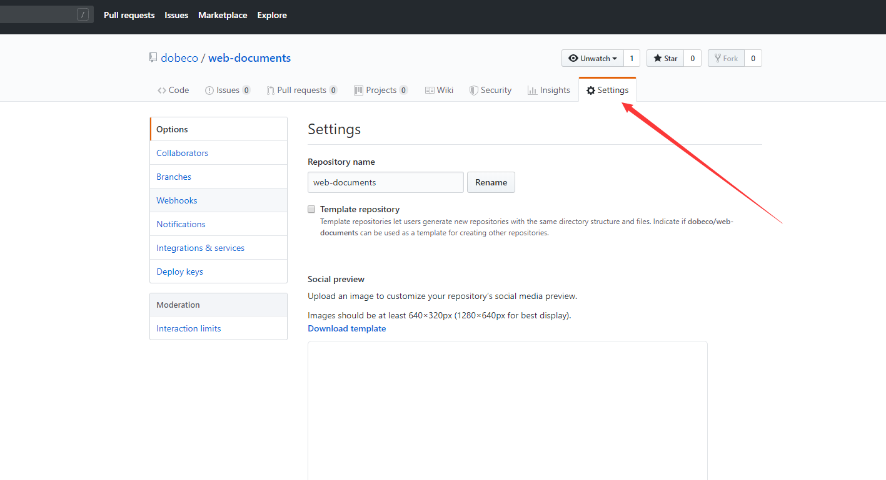
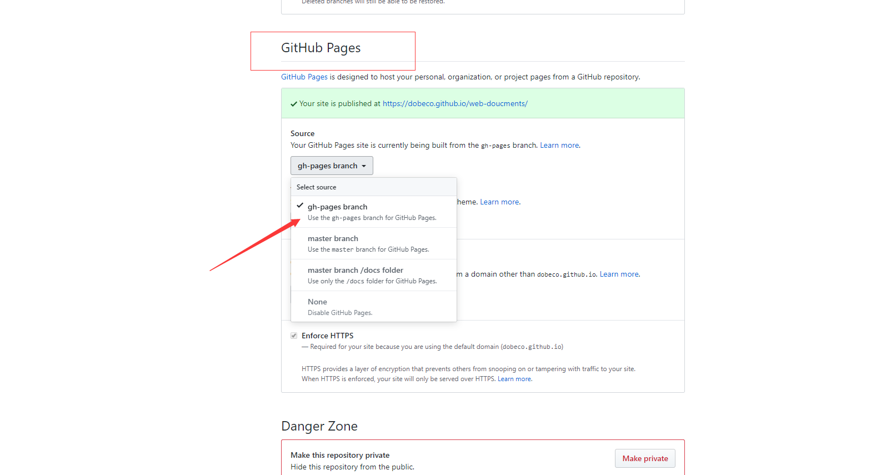

# vupress搭建静态文档项目

## 关于

本仓库用来存放前端学习笔记，以前做笔记散落在电脑的各个角落，每次翻看笔记比较麻烦，有个集中管理的地方比较好。

`vuepress`是个不错的选择，带搜索功能，查找方便，单页`SSR`应用，加载这种纯文字的网页非常快！

## 如何部署到GIthub Pages上？

### 第一步、获取项目并安装依赖
```bash
git clone https://github.com/dobeco/web-documents.git
cd web-documents
yarn install

```


### 第二步、修改deploy.sh文件

替换成你的用户名和仓库名，需要在本地配置`SSH Key`，参考：[GitHub如何配置SSH Key](https://blog.csdn.net/u013778905/article/details/83501204)
```
# 如果发布到 https://<USERNAME>.github.io/<REPO>
 git push -f git@github.com:<USERNAME>/<REPO>.git master:gh-pages

cd -
```

项目`push`到你的仓库之后，在命令行执行下列命令：

```bash
yarn deploy
```

OK，脚本执行完会在你的仓库创建一个分支：`gh-pages`，
执行`yarn docs:build会在docs/.vuepress/`目录下生成dist文件夹，如果你想修改打包文件位置，请参考[vuepress](https://vuepress.vuejs.org/zh/config/)文档，并修改`deploy.sh`脚本文件

### 第三步、GitHub Pages主页设置

接下来，打开你的项目主页找到`Setting`选项



往下滚动找到`GitHub Pages`选项，分支选择`gh-pages`，上面的`deploy.sh`脚本已经在项目中创建了该分支，如果这里不显示则代表没有该分支，检查下是不是第二步出问题了。



